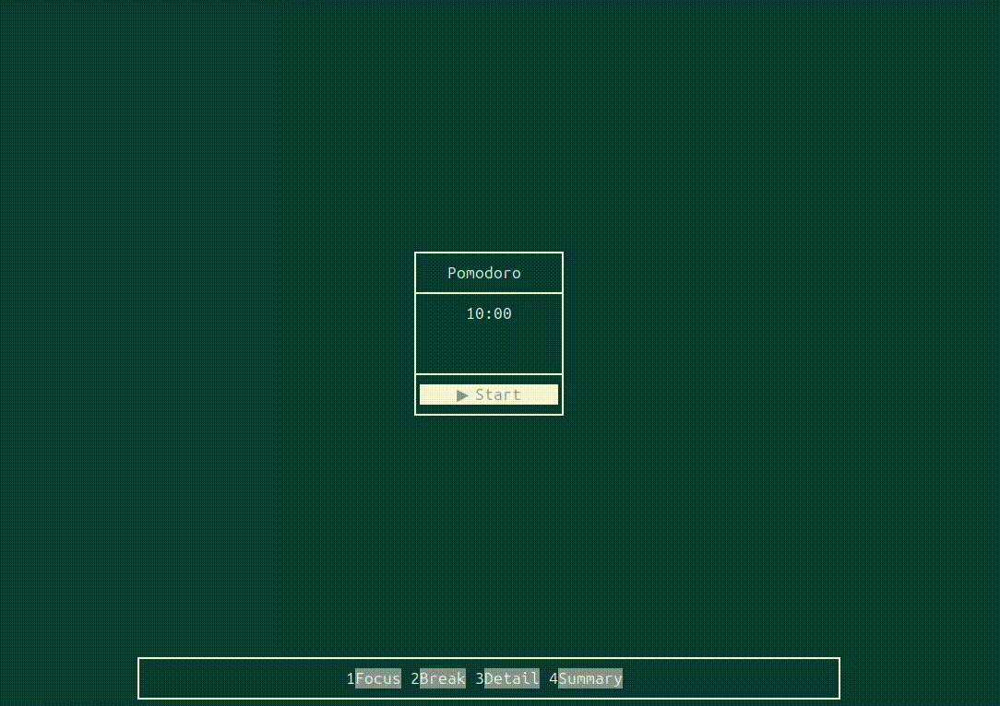

# PomoTrack 🍅

PomoTrack — это CLI утилита для трекинга рабочих и перерывных интервалов по методу Pomodoro. Программа сохраняет статистику сессий. Вдохновлено [Pomofocus](https://pomofocus.io/).    
   
## Application options
```
      --focuse-duration=       setup pomodoro focus intreval (default 25m)
      --break-duration=        setup break interval (default 5m)
      --hidden-focus-time      hide focus clock (default false)
``` 
Продолжительность можно указывать в минутах (`m`) или часах (`h`), например: `25m` или `1h`.

## Demo
